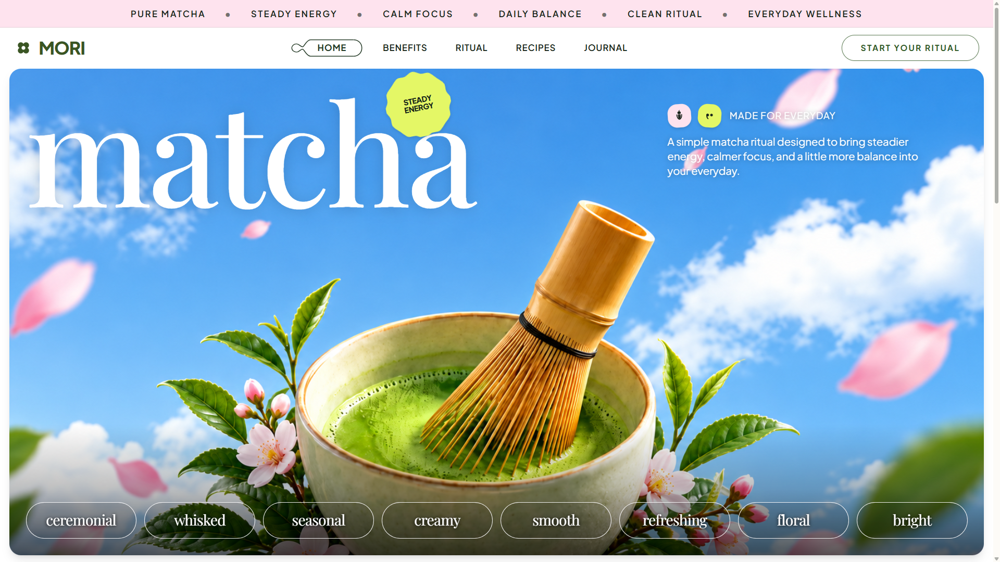

<div align="center">

  # 🍵 MORI — Pure Matcha Ritual

  **A modern Japanese minimalist editorial web experience designed for steadier energy, calmer focus, and everyday balance.**

  

  [](https://react.dev/)
  [](https://www.typescriptlang.org/)
  [](https://vitejs.dev/)
  [](https://tailwindcss.com/)
  [](https://motion.dev/)

</div>

---

## 🌿 Overview

**MORI Matcha** is an editorial web application celebrating the art and mindfulness of traditional Japanese matcha. Crafted with high-fashion typography, organic tactile stickers, fluid butter-smooth physics, and responsive layouts, it transports users into a mindful, premium wellness ritual.

---

## 🎨 Design Philosophy & Aesthetic Style

**Style Definition:** *Modern Japanese Minimalist Editorial / Neo-Brutalist Organic Wellness*

* **Editorial Tea Culture:** Merges classical editorial serif typography with bold modern sans-serif geometric elements and generous negative space.
* **Warm Organic & Tactile Accents:** Organic scalloped badges, pastel pink stickers, puffy pillows, electric lime arch tabs, and subtle glassmorphic elements.
* **Liquid Micro-Interactions:** 60fps/120fps hardware-accelerated animations using `motion/react`, custom SVG path morphing, and fluid spring physics.

### 🎨 Color Palette

| Color | Hex Code | Role & Usage |
| :--- | :--- | :--- |
| **Deep Forest Black** | `#182319` | Primary typography, high-contrast borders, dark button fills. |
| **Brand Leaf Green** | `#3A5523` | Main MORI brand clover mark and header logo typography. |
| **Editorial Forest Green** | `#2F5824` | Active nav indicator stroke, pill button borders, headline accents. |
| **Deep Button Green** | `#244E1D` | Newsletter submit and interactive button fills (`hover: #1C3E16`). |
| **Matcha Lime Jade** | `#E4F766` | Scalloped `STEADY ENERGY` badge, arch dome tab, selection highlight. |
| **Soft Blossom Pink** | `#FEE3EE` / `#FCE5EE` | Top announcement ticker, whisk sticker, puffy pillow sticker, social links. |
| **Canvas White** | `#FFFFFF` | Background canvas, card containers, hero text, and contrast fills. |
| **Warm Track Background** | `#FDFBF7` | Branded matcha custom scrollbar track. |

### 🖋️ Typography Stack (100% Self-Hosted Local Fonts)

All fonts are **100% self-hosted locally** (50 `.woff2` font files in `public/fonts/` defined in `src/fonts.css`), ensuring zero render-blocking Google CDN latency, zero layout shift (FOUT/FOIT), and complete offline readiness.

* **Playfair Display (`.font-playfair`):** Large editorial headlines (`"matcha"`, `"a small ritual for slower,"`, and the giant anchor `"wellness"`).
* **Instrument Serif (`.font-instrument-serif italic`):** Poetic italic contrast (`"better days."`, `"made part of every day."`).
* **Outfit (`.font-outfit`):** Geometric, clean modern taglines and section pitches.
* **Google Sans Flex / Plus Jakarta Sans (`.font-sans-flex`):** Primary UI, brand logo `"MORI"`, ticker items, navigation pills, and interactive buttons.

---

## ✨ Key Features & Interactive Architecture

### 1. 🧈 Smart Buttery Floating Pill Navbar
* **Scroll-Down Hide:** Seamlessly slides up out of sight (`y: -100%`) when scrolling down.
* **Scroll-Up Reveal:** The moment the user scrolls up even a few pixels, **only the white navigation bar** slides down (`y: 0%`) and docks at the top as an elegant floating capsule (`rounded-full border border-[#182319]/15 shadow-md backdrop-blur-md`).
* **Hero Return:** Returns to its flat edge-to-edge layout below the pink announcement ticker when scrolled back to the top.
* **Zero Layout Shift:** Maintains an invisible height placeholder in the document flow to ensure zero content jump.

### 2. 🌸 Hero Section
* Responsive scalloped 12-lobed flower badge (`STEADY ENERGY`) with spring physics and hover tilt.
* Tactile micro-stickers (pink whisk + lime matcha drop) paired with `MADE FOR EVERYDAY` label.
* Interactive 3-minute morning ritual modal (`Begin your daily bowl`).
* Bottom row of 8 responsive ceramic attribute pills (`ceremonial`, `whisked`, `seasonal`, `creamy`, etc.).

### 3. 🍵 Products Display Section (The MORI Ritual)
* Top fog haze gradient blending into the matcha background image (`Hero-2_ni72bb.png`).
* Kicker label `THE MORI RITUAL` with 4-petal pink clover.
* Two-line headline with word-anchored stickers:
  - Pink wavy pillow sticker (`SIP, DON'T / RUSH`) directly above `small`.
  - Lime arch dome sticker (`TAKE IT / SLOW`) directly above `slower,`.
* Standalone reusable **`<ProductCard />`** component rendering the 3 ritual drinks:
  - **PURE** — Traditional Ceremonial
  - **CREAMY** — Iced Matcha Latte
  - **BRIGHT** — Strawberry Matcha

### 4. 🌿 Everyday Wellness Section
* Deep matcha green grid texture canvas (`Green_Grid_doxpoc.png`) framed by white margins (`px-2 sm:px-3 md:px-4`).
* Word-anchored tactile stickers: `CALM IN A CUP` on `good.` and `STEADY, NOT / SPEEDY` on `every day.`.
* Interactive 2x2 benefit cards (`MORNING ENERGY`, `MIDDAY RESET`, `CALM FOCUS`, `DAILY BALANCE`) with crisp white active states and tactile hover lift.
* 3-slide touch-swipeable portrait carousel with circular navigation arrows powered by `onPanEnd` with Apple cubic-bezier `[0.16, 1, 0.3, 1]`.

### 5. 🍵 Four Simple Steps Ritual Accordion
* Hover-activated editorial accordion guiding through the four steps of matcha preparation (`1 scoop`, `2 pour`, `3 whisk`, `4 enjoy`).
* **Auto-Collapse on Cursor Leave:** All 4 steps return to their clean typographic state when the mouse leaves the section.
* **Descender Clipping Prevention:** Lowercase `p` in `scoop` and `pour` is fully visible with generous clipping padding (`pb-3 sm:pb-4 md:pb-5`).
* Panoramic 3:1 cards with high-res photography, italic script headings, and microcopy.
* Apple-grade Framer Motion `layout` orchestration with `0.55s` ease `[0.16, 1, 0.3, 1]` and GPU acceleration.

### 6. 🌸 Pure By Nature Section
* Organic bamboo whisk and spilled matcha powder cutout (`Whisk_Matcha_Powder_mefsa2.png`, transparent background) positioned boldly on the left viewport edge with large scale (`max-w-[780px]` to `max-w-[960px]`).
* Top kicker: 4-petal pink flower icon + `PURE BY NATURE`.
* Two-line editorial title with 3 word-anchored stickers:
  - Pink pillow `NOTHING / EXTRA` on `nature,`
  - Lime ticket `JUST THE / GOOD / STUFF` on `powerful`
  - Green wave `NATURALLY VIBRANT` beneath `cup.`
* Bottom row pairing a rounded iced matcha card with an editorial narrative paragraph.

### 7. 📰 Editorial Responsive Footer
* Panoramic Sakura Matcha editorial banner (`Footer_vgqmsa.png`) integrated with `rounded-xl sm:rounded-2xl md:rounded-[20px]`.
* Two-column split layout with editorial heading (`matcha, made part of every day.`) and embedded pill newsletter form.
* Circular pink social links (Instagram, TikTok, Pinterest).
* Giant anchor typography **`wellness`** with metallic gradient (`from-[#0A0A0A] to-[#959A9F]`):
  - **Desktop (`lg+`):** Spans broadly with the final `s` extending into the right margin.
  - **Mobile:** Dynamically sized (`24vw`) so the word spans the screen while keeping the `s` cleanly inside the viewport without truncation.

---

## 🛠️ Tech Stack

* **Framework:** [React 18](https://react.dev/) + [Vite](https://vitejs.dev/)
* **Language:** [TypeScript](https://www.typescriptlang.org/)
* **Styling:** [Tailwind CSS v4](https://tailwindcss.com/) (`@tailwindcss/vite`) + Vanilla CSS tokens
* **Animation & Motion:** [Motion (Framer Motion v13)](https://motion.dev/)
* **Icons:** [Lucide React](https://lucide.dev/)
* **Routing:** [React Router DOM v7](https://reactrouter.com/)

---

## 📁 Project Structure

```bash
Mori-Matcha/
├── public/
│   ├── fonts/                 # 50 self-hosted .woff2 font files (zero CDN lag)
│   ├── Thumbnail.png          # High-resolution project thumbnail (Open Graph / Twitter)
│   └── Thumbnail.jpg
├── src/
│   ├── components/
│   │   ├── Navbar.tsx                 # Smart floating pill navbar with scroll direction physics
│   │   ├── Hero.tsx                   # Full-bleed hero banner, interactive ritual modal, badge
│   │   ├── ProductsSection.tsx        # Ritual section with fog gradient & word-anchored stickers
│   │   ├── ProductCard.tsx            # Standalone ritual drink card component with hover lift
│   │   ├── EverydayWellnessSection.tsx# Grid section with 2x2 cards & touch-swipeable carousel
│   │   ├── RitualStepsSection.tsx     # Four Simple Steps hover accordion with auto-collapse
│   │   ├── PureByNatureSection.tsx    # Left-bleed whisk, word stickers & iced matcha card
│   │   └── Footer.tsx                 # Editorial split footer with Sakura banner & 'wellness'
│   ├── pages/
│   │   └── Landing-Page.tsx           # Master page composition uniting all 6 sections
│   ├── App.tsx                        # App root with React Router
│   ├── fonts.css                      # Local @font-face declarations mapping /fonts/...
│   ├── index.css                      # Tailwind v4 imports, custom fonts, scrollbar styles
│   └── main.tsx                       # DOM entry point
├── AGENTS.md                          # Comprehensive AI agent instructions & technical gotchas
├── DESIGN.md                          # Complete design system, hex colors, & typography rules
├── MEMORY.md                          # Architectural decisions ledger & component evolution history
├── index.html                         # HTML shell with Open Graph / Twitter Card social previews
├── package.json
├── tsconfig.json
└── vite.config.ts
```

---

## 🚀 Getting Started

### Prerequisites

Ensure you have [Node.js](https://nodejs.org/) (version 18 or higher recommended) and `npm` installed.

### Installation

1. **Clone the repository:**
   ```bash
   git clone https://github.com/panduthegang/Mori-Matcha.git
   cd Mori-Matcha
   ```

2. **Install dependencies:**
   ```bash
   npm install
   ```

3. **Start the development server:**
   ```bash
   npm run dev
   ```
   Open your browser and navigate to `http://localhost:5173`.

### Build for Production

```bash
npm run build
```

The optimized production bundle will be generated in the `dist/` directory.

### Preview Production Build

```bash
npm run preview
```

---

## 📄 License

This project is licensed under the [Apache-2.0 License](LICENSE).

<div align="center">
  <sub>Crafted with calm and steady energy 🍵</sub>
</div>
